<div align="center">
</img>
<h3></h3>
<h2>Computation Cost Attack on 3D Gaussian Splatting</h2>

Jiahao Lu, [Yifan Zhang](https://sites.google.com/view/yifan-zhang), [Qiuhong Shen](https://florinshen.github.io/), [Xinchao Wang](https://scholar.google.com/citations?user=w69Buq0AAAAJ&hl=en&oi=ao), [Shuicheng Yan](https://scholar.google.com/citations?user=DNuiPHwAAAAJ&hl=en&oi=ao)


[Skywork AI](http://www1.kunlun.com/research/en/), [National University of Singapore](https://nus.edu.sg)
<!-- <a href="https://opensource.org/licenses/Apache-2.0"></a>
<a href="" target="_blank"></a> -->
:bookmark:[[Arxiv]](https://arxiv.org/pdf/2410.08190)
<h1></h1>
</div>

<p align="center">

</p>

## Table of Contents
- [Introduction](#introduction)
- [Installation](#installation)
    - [Project Organization](#project-organization)
    - [Enviroment Installation](#enviroment-installation)
    - [Download Datasets](#download-datasets)
    - [Verify Installation](#verify-installation)
- [Quickstart](#quickstart)
    - [Benchmark clean datasets computation cost](#benchmark-clean-datasets-computation-cost)
    - [Poison, and benchmark poisoned datasets computation cost](#create-poisoned-datasets-and-benchmark-corresponding-computation-cost)
    - [Benchmark black-box attack performance](#benchmark-black-box-attack-performance)
    - [Defense strategy](#defense-strategy)
- [Visualization]()
- [Citation](#citation)


## Introduction
We identify an overlooked security vulnerability of 3D Gaussian Splatting by revealing a novel attack surface: the computation complexity of training 3DGS could be maliciously manipulated by poisoning the input data.

The key observation behind this new attack surface lies in the inherent flexibility in model complexity. 
<p align="center">
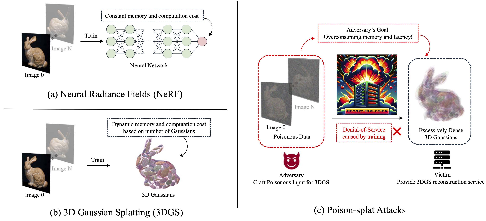
</p>

Unlike NeRF or any other neural-network-driven machine learning systems which has pre-fixed and consistent computation cost (Fig. a), 3DGS has **adaptively flexible computation complexity**(i.e, number of parameters, training time cost and GPU memory consumption) **depending on the content of input** (Fig. b).  This flexibility leaves backdoor to computation cost attacks (Fig. c).

We model attack via max-min bi-level optimization problem:
```math
\mathcal{D}_p  =  \mathop{\arg\max}\limits_{\mathcal{D}_p} \mathcal{C}(\mathcal{G}^*), ~~ \text{s.t.\quad } \mathcal{G}^* = \mathop{\arg\min}\limits_{\mathcal{G}} \mathcal{L}(\mathcal{D}_p),
```

Where inner loop is the victim goal: minimize reconstruction error $\mathcal{L}(\mathcal{D}_p)$ during 3DGS training, and the outer loop is the attacker goal: making a poisoned dataset $\mathcal{D}_p$ to maximize victim's computation cost $\mathcal{C}(\mathcal{G}^*)$ spent on 3DGS training.

With constraints on perturbation strength ($\epsilon= 16/255$), for some scenes the attacker can raise the parameters needed to above 6 times and the GPU memory comsumption to above 8 times.
<p align="center">
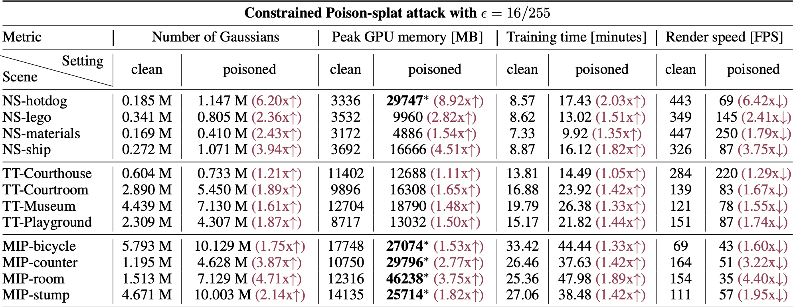
</p>

If the attacker is allowed to unlimitedly alter input data, the attack can be more damaging, sometimes achieving 80 GB GPU memory consumption, which is enough to cause an out-of-memory error and denial-of-service on most GPUs.

<p align="center">
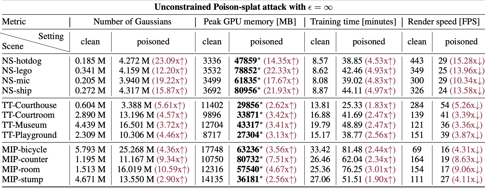
</p>


## Installation
### Project Organization
```
poison-splat
    |---assets
        (directory for project introduction figures)
    |---attacker
        (directory for attacker behavior)
    |---dataset
        (directory for saving clean and poisoned datasets)
    |---exp
        (directory for experiment scripts)
    |---log
        (directory for experiment records)
    |---victim
        (directory for victim behavior)
```

### Enviroment Installation
First create a conda environment with pytorch-gpu. CUDA version 11.8 recommended.
```
conda create -n poison_splat python=3.11 -y
conda activate poison_splat
conda install pytorch torchvision pytorch-cuda=11.8 -c pytorch -c nvidia -y
pip install -r requirements.txt
```

### Download Datasets

Instructions of how to download `NeRF-Synthetic`, `MIP-NeRF360` and `Tanks-and-Temples` original datasets are provided in `dataset` directory.

For poisoned datasets, you can run poison-splat to make a poisoned dataset following the [data poisoning scripts](#create-poisoned-datasets-and-benchmark-corresponding-computation-cost) or alternatively, downloading our poisoned datasets:

Google Drive: https://drive.google.com/file/d/11EZwsxRxWEAOnOThoOEJVre77Q5_SQfx/view?usp=sharing


### Verify Installation

After installing the environment and downloading the `NeRF-Synthetic` dataset, you can verify your installation by running testing script:

```
bash exp/00_test/test_install.sh
```

## Quickstart

### Benchmark clean datasets computation cost
```
bash exp/01_main_exp/benchmark_nerf_synthetic_clean.sh
bash exp/01_main_exp/benchmark_mip_nerf_360_clean.sh
bash exp/01_main_exp/benchmark_tanks_and_temples_clean.sh
```
Please note that the above scripts assume you have 8-GPU environment. If not, please change the GPU device id by resetting the `--gpu` argument in each script.

### Create poisoned datasets and benchmark corresponding computation cost
Constrained attack with perturbation 16/255:

```
bash exp/01_main_exp/eps16_attack_nerf_synthetic.sh
bash exp/01_main_exp/eps16_attack_mip_nerf_360.sh
bash exp/01_main_exp/eps16_attack_tanks_and_temples_1.sh
bash exp/01_main_exp/eps16_attack_tanks_and_temples_2.sh
bash exp/01_main_exp/eps16_attack_tanks_and_temples_3.sh
```

Unconstrained attack:
```
bash exp/01_main_exp/unbounded_attack_nerf_synthetic.sh
bash exp/01_main_exp/unbounded_attack_mip_nerf_360.sh
bash exp/01_main_exp/unbounded_attack_tanks_and_temples_1.sh
bash exp/01_main_exp/unbounded_attack_tanks_and_temples_2.sh
bash exp/01_main_exp/unbounded_attack_tanks_and_temples_3.sh
```

### Benchmark black-box attack performance
We borrowed implementation from [Scaffold-GS](https://github.com/city-super/Scaffold-GS) as a black-box victim, and benchmark their performance directly on the poisoned datasets for traditional Gaussian Splatting.

Following scripts in `exp/02_blackbox_generalize/` to benchmark black-box attack performance.

To test the black-box performance for other variants of Gaussian Splatting, first implement the victim behavior in `victim/` folder. Be especially careful about the environment conflict - for example the `diff-gaussian-rasterization` library. `vicim/Scaffold-GS/submodules/diff-guassian-rasterization_scaffold/` gives an example of resolving such name conflicts.

Following the benchmark scripts `victim/gaussian-splatting/benchmark.py` and `victim/Scaffold-GS/benchmark.py`, write a script for benchmarking the newly added victim. 

### Defense strategy
We implemented one naive defense strategy in `victim/gaussian-splatting/defense/` where the maximum number of Gaussians involved in training is restricted. Run scripts in `exp/05_naive_defense/` to apply defensive training strategy.

## Visualizations

We put some visualizations of attacker poisoned data and the corresponding victim reconstructions here.

### Constrained attack ($\epsilon=16/255$)

dataset setting | Attacker Poisoned Image | Victim Reconstructed Image | PSNR |
| :-: | :-: | :-: | :-: |
| NS-Chair-eps16 |  | 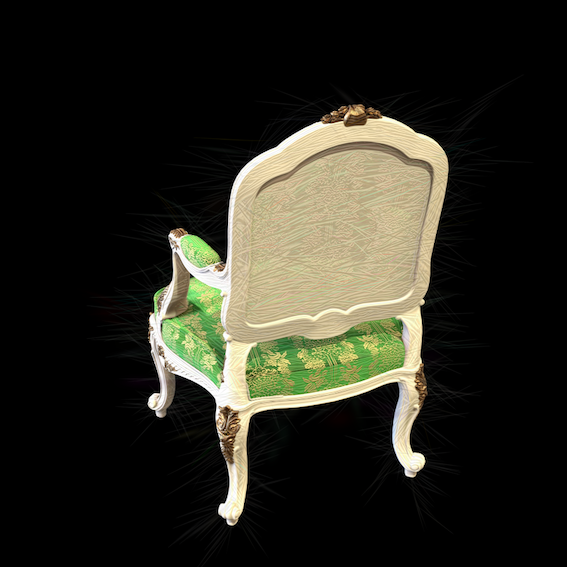 | 37.07 dB |
| NS-Drums-eps16 | 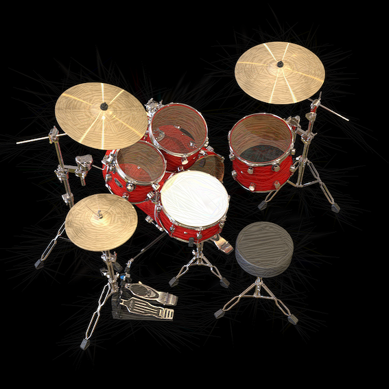 |  | 30.32 dB |
| MIP-bicycle-eps16 |  |  | 18.20 dB |
| MIP-bonsai-eps16 | 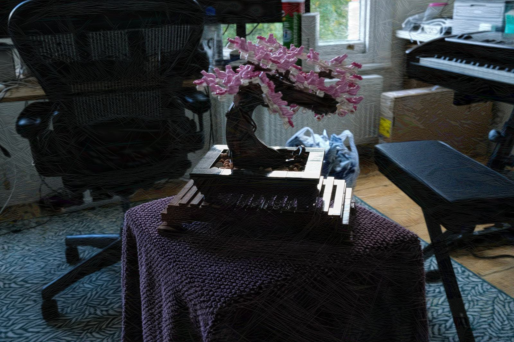 |  | 22.67 dB |

### Unconstrained attack

dataset setting | Attacker Poisoned Image | Victim Reconstructed Image | PSNR |
| :-: | :-: | :-: | :-: |
| NS-Chair-Unconstrained | 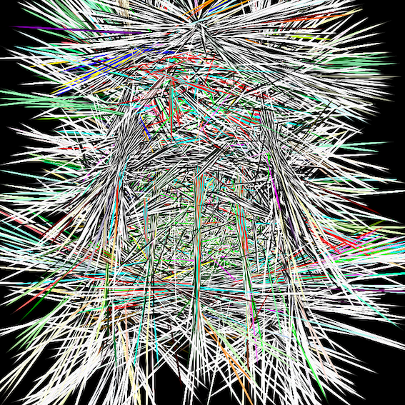 |  | 19.54 dB |
| NS-Drums-Unconstrained | 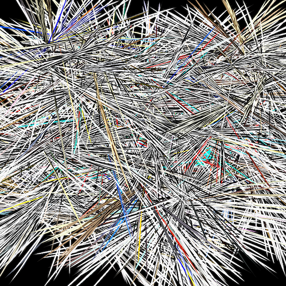 | 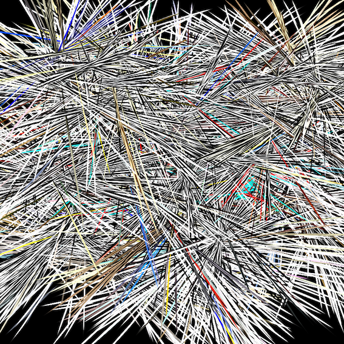 | 18.65 dB |
| MIP-bicycle-Unconstrained |  | 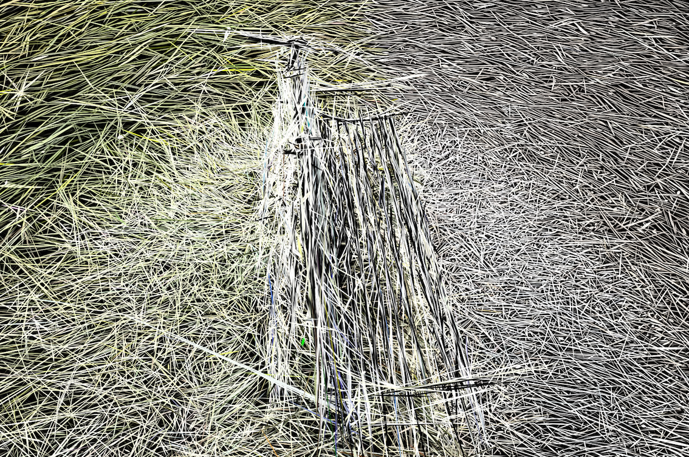 | 20.57 dB |
| MIP-bonsai-Unconstrained | 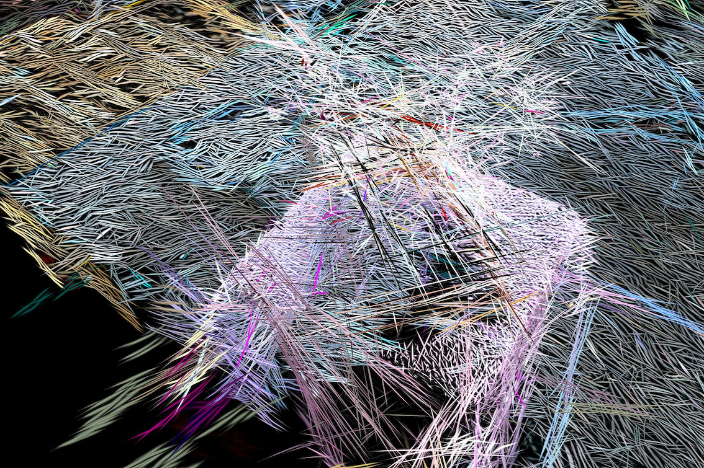 |  | 23.66 dB |

## Citation
If you consider this repostory useful for your research, please consider citing:
```
@article{lu2024poisonsplat,
  title={Poison-splat: Computation Cost Attack on 3D Gaussian Splatting},
  author={Lu, Jiahao and Zhang, Yifan and Shen, Qiuhong and Wang, Xinchao and Yan, Shuicheng},
  journal={arXiv preprint arXiv:2410.08190},
  year={2024}
}
```
