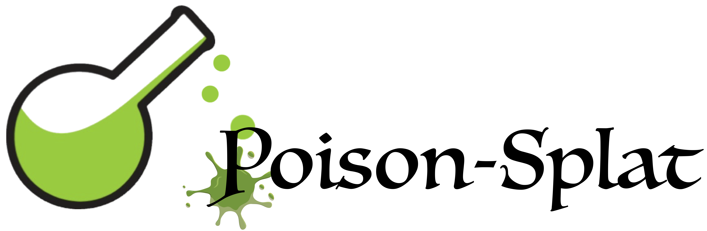

<div align="center">
</img>
<h3></h3>
<h2>Computation Cost Attack on 3D Gaussian Splatting</h2>
<a href="https://opensource.org/licenses/Apache-2.0"></a>
<a href="" target="_blank"></a>
</div>

<p align="center">

</p>

## Table of Contents
- [Installation](#installation)
    - [Project Organization](#project-organization)
    - [Enviroment Installation](#enviroment-installation)
    - [Verify Installation](#verify-installation)
- [Quickstart](#quickstart)
    - [Benchmark clean datasets computation cost](#benchmark-clean-datasets-computation-cost)
    - [Poison, and benchmark poisoned datasets computation cost](#create-poisoned-datasets-and-benchmark-corresponding-computation-cost)
    - [Benchmark black-box attack performance](#benchmark-black-box-attack-performance)
    - [Defense strategy](#defense-strategy)
- [Citation](#citation)

## Installation
### Project Organization
```
poison-splat
    |---assets
        (directory for project introduction figures)
    |---attacker
        (directory for attacker behavior)
    |---dataset
        (directory for saving clean and poisoned datasets)
    |---exp
        (directory for experiment scripts)
    |---log
        (directory for experiment records)
    |---victim
        (directory for victim behavior)
```

### Enviroment Installation
First create a conda environment with pytorch-gpu. CUDA version 11.8 recommended.
```
conda create -n poison_splat python=3.11 -y
conda activate poison_splat
conda install pytorch torchvision pytorch-cuda=11.8 -c pytorch -c nvidia -y
pip install -r requirements.txt
```

### Download clean datasets

Instructions of how to download `NeRF-Synthetic`, `MIP-NeRF360` and `Tanks-and-Temples` datasets are provided in `dataset` directory.


### Verify Installation

After installing the environment and downloading the `NeRF-Synthetic` dataset, you can verify your installation by running testing script:

```
bash exp/00_test/test_install.sh
```

## Quickstart

### Benchmark clean datasets computation cost
```
bash exp/01_main_exp/benchmark_nerf_synthetic_clean.sh
bash exp/01_main_exp/benchmark_mip_nerf_360_clean.sh
bash exp/01_main_exp/benchmark_tanks_and_temples_clean.sh
```
Please note that the above scripts assume you have 8-GPU environment. If not, please change the GPU device id by resetting the `--gpu` argument in each script.

### Create poisoned datasets and benchmark corresponding computation cost
Constrained attack with perturbation 16/255:

```
bash exp/01_main_exp/eps16_attack_nerf_synthetic.sh
bash exp/01_main_exp/eps16_attack_mip_nerf_360.sh
bash exp/01_main_exp/eps16_attack_tanks_and_temples_1.sh
bash exp/01_main_exp/eps16_attack_tanks_and_temples_2.sh
bash exp/01_main_exp/eps16_attack_tanks_and_temples_3.sh
```

Unconstrained attack:
```
bash exp/01_main_exp/unbounded_attack_nerf_synthetic.sh
bash exp/01_main_exp/unbounded_attack_mip_nerf_360.sh
bash exp/01_main_exp/unbounded_attack_tanks_and_temples_1.sh
bash exp/01_main_exp/unbounded_attack_tanks_and_temples_2.sh
bash exp/01_main_exp/unbounded_attack_tanks_and_temples_3.sh
```

### Benchmark black-box attack performance
We borrowed implementation from [Scaffold-GS](https://github.com/city-super/Scaffold-GS) as a black-box victim, and benchmark their performance directly on the poisoned datasets for traditional Gaussian Splatting.

Following scripts in `exp/02_blackbox_generalize/` to benchmark black-box attack performance.

To test the black-box performance for other variants of Gaussian Splatting, first implement the victim behavior in `victim/` folder. Be especially careful about the environment conflict - for example the `diff-gaussian-rasterization` library. `vicim/Scaffold-GS/submodules/diff-guassian-rasterization_scaffold/` gives an example of resolving such name conflicts.

Following the benchmark scripts `victim/gaussian-splatting/benchmark.py` and `victim/Scaffold-GS/benchmark.py`, write a script for benchmarking the newly added victim. 

### Defense strategy
We implemented one naive defense strategy in `victim/gaussian-splatting/defense/` where the maximum number of Gaussians involved in training is restricted. Run scripts in `exp/05_naive_defense/` to apply defensive training strategy.


## Citation
If you consider this repostory useful for your research, please consider citing:
```
@article{lu2024poisonsplat,
  title={Poison-splat: Computation Cost Attack on 3D Gaussian Splatting},
  author={Lu, Jiahao and Zhang, Yifan and Shen, Qiuhong and Wang, Xinchao and Yan, Shuicheng},
  journal={},
  year={2024}
}
```
